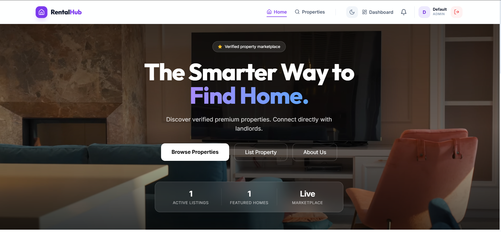
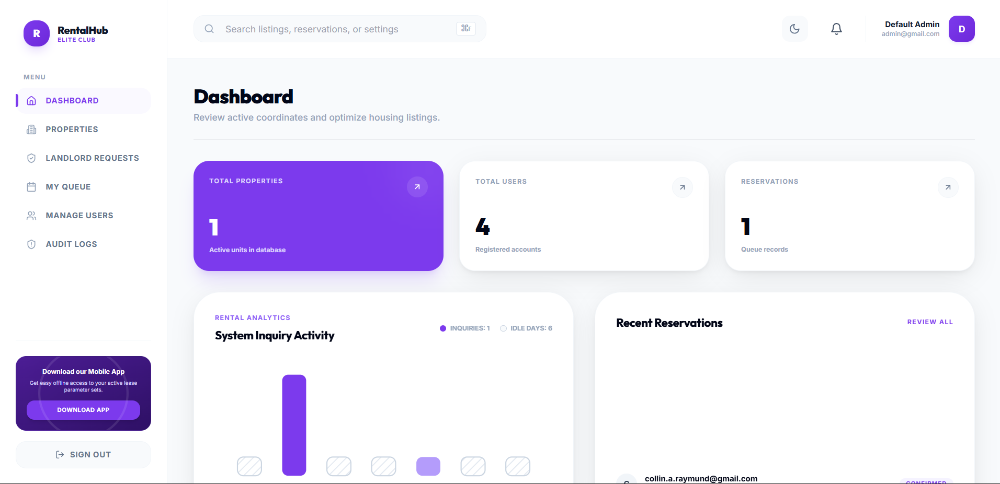

<div align="center">

<h1 align="center">
  
</h1>

<p align="center">
  A premium, full-stack real estate management system with strictly governed role-based access for Admins, Landlords, Agents, and Tenants. Built for speed, security, and unparalleled aesthetics.
</p>

<p align="center">
  
  
  
  
  
</p>

<p align="center">
  
  
  
</p>

---

</div>

## ✨ Features

RentalHub is packed with high-end features designed to make property management feel effortless:

- 🎨 **Glassmorphic & Adaptive UI**: A stunning, modern, fully responsive user interface utilizing Tailwind CSS, dark mode support, and smooth framer-motion animations.
- 🛡️ **Role-Based Workflows**: Custom dashboards and capabilities tailored for **Tenants**, **Landlords**, **Agents**, and **Admins**.
- 🔐 **Robust Authentication**: Secure JWT-based sessions, OTP email verification for landlord onboarding, and protected routing.
- 📊 **Dynamic Analytics Engine**: Real-time property and lease analytics with custom SVG charts and automated calculations.
- 📅 **Smart Reservations**: Automated queueing system for fair property leasing, tracking queue positions and automatic lease approvals.
- ⭐ **Verified Review System**: Public property exploration with strict tenant-only rating enforcement (you can only review what you've actually rented).
- ✉️ **Automated Mailing**: System-generated emails for lease conclusions, OTPs, and registration events.

<br/>

## 🏗️ Architecture & Tech Stack

### Backend (`/backend`)
- **Java 17 & Spring Boot 3.4.1**: Robust REST API framework.
- **Spring Security & JWT**: Stateless authentication and endpoint protection.
- **Spring Data JPA & Hibernate**: ORM mapping and data persistence.
- **PostgreSQL**: Relational database for transactional integrity.
- **JavaMailSender**: SMTP integration for automated notifications.

### Frontend (`/frontend`)
- **React 18 & Vite**: Lightning-fast modern frontend development.
- **Tailwind CSS**: Utility-first styling for glassmorphic and modern UI design.
- **React Router Dom (v6)**: Declarative, secure protected routing.
- **Framer Motion**: Fluid UI transitions and micro-animations.
- **Axios**: Configured API client with automatic token injection.
- **Lucide React**: Clean, modern iconography.

<br/>

## 🚀 Getting Started

Follow these instructions to get a copy of the project up and running on your local machine for development and testing purposes.

### Prerequisites

You need the following installed on your system:
- **Java 17** or higher
- **Node.js 18** or higher
- **PostgreSQL** (running on port `5432`)
- **Maven** (optional, wrapper is included)

### Database Setup

1. Open PostgreSQL (via `psql` or pgAdmin).
2. Create a new database for the system:
```sql
CREATE DATABASE houserental;
```
3. *(Optional)* Update the database credentials in `backend/src/main/resources/application.properties` if they differ from the defaults:
```properties
spring.datasource.url=jdbc:postgresql://localhost:5432/houserental
spring.datasource.username=postgres
spring.datasource.password=your_password
```

### 1. Starting the Backend

Navigate to the `backend` directory and run the Spring Boot application:

```bash
cd backend

# On Windows
.\mvnw.cmd spring-boot:run

# On macOS/Linux
./mvnw spring-boot:run
```
*The backend server will start on `http://localhost:8080`.*

### 2. Starting the Frontend

Open a new terminal, navigate to the `frontend` directory, install dependencies, and start the Vite dev server:

```bash
cd frontend
npm install
npm run dev
```
*The frontend application will start on `http://localhost:5173`.*

<br/>

## 📸 Sneak Peek


| Marketplace | Dashboard Analytics |
| :---: | :---: |
|  |  |

<br/>

## 🔒 Default Roles & Routing

RentalHub strictly enforces routing based on roles to ensure data integrity:
- **Unauthenticated**: Can access Marketplace, About, Manual, and Authentication pages.
- **Tenant (`/properties`)**: Can browse properties, queue for reservations, and leave reviews post-lease.
- **Landlord (`/dashboard`)**: Can list properties, accept tenant reservations, and view revenue analytics. Requires NIDA & TIN verification upon registration.
- **Agent (`/dashboard`)**: Middlemen who verify landlord credentials and property listings.
- **Admin (`/dashboard`)**: Has global access to user management, system audit logs, and override capabilities.

*Note: Navigating to authentication routes while logged in will safely redirect the user back to their respective portal.*

<br/>

<div align="center">


</div>
